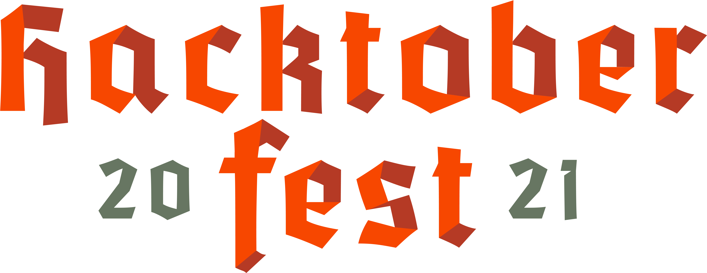

Hacktoberfest, in its 8th year, is a month-long celebration of open source software run by DigitalOcean. During the month of October, we invite you to join open-source software enthusiasts, beginners, and the developer community by contributing to open-source projects. You can do this in a variety of ways:

- Prepare and share your project for collaboration
- Contribute to the betterment of a project via pull requests
- Organize an event
- Mentor others
- Donate directly to open source projects
   
<h2 align="center"> 🎉 High hopes for your first PR ! 🎉 </h2>
 
<h3>Instructions for Contribution are in the CONTRIBUTING.md</h3>
